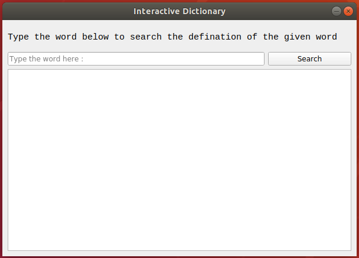
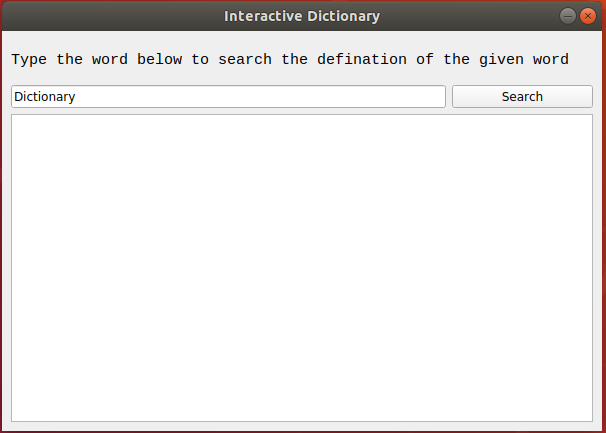
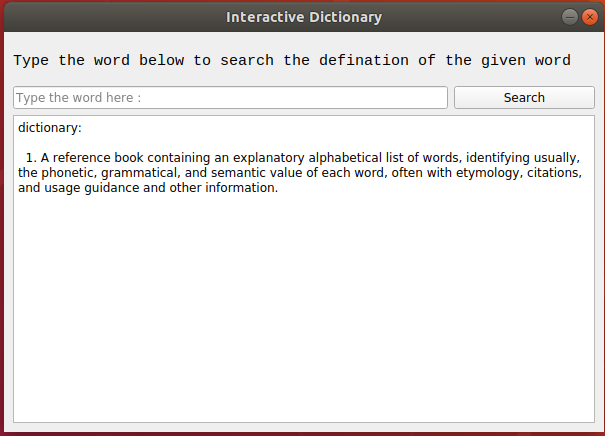
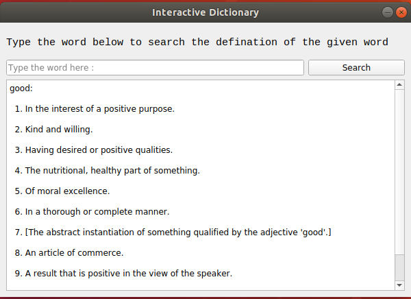
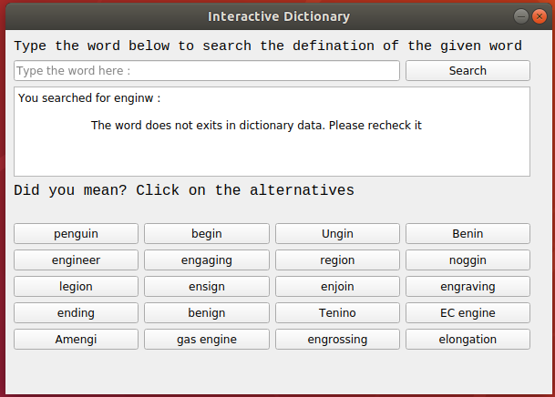
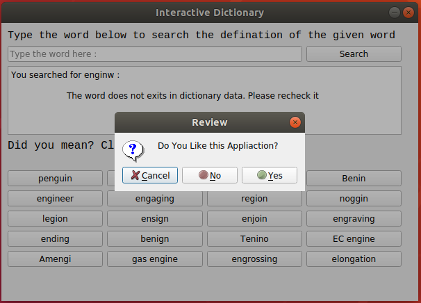

**Interactive Dictionary : A Desktop Application**

Language: Python3
Frameworks: PyQt5 (a wrapper around QT Framework in python)
Libraries: difflib

FEATURES:

1. Desktop Application providing definition of words or phrases.

2. If a word has multiple meanings, all of them will be listed.

3. Alternative words will be provided in case you misspell. The alterantive words are sorted according to their matching ratio.

_See the Screenshots of the  Application_

